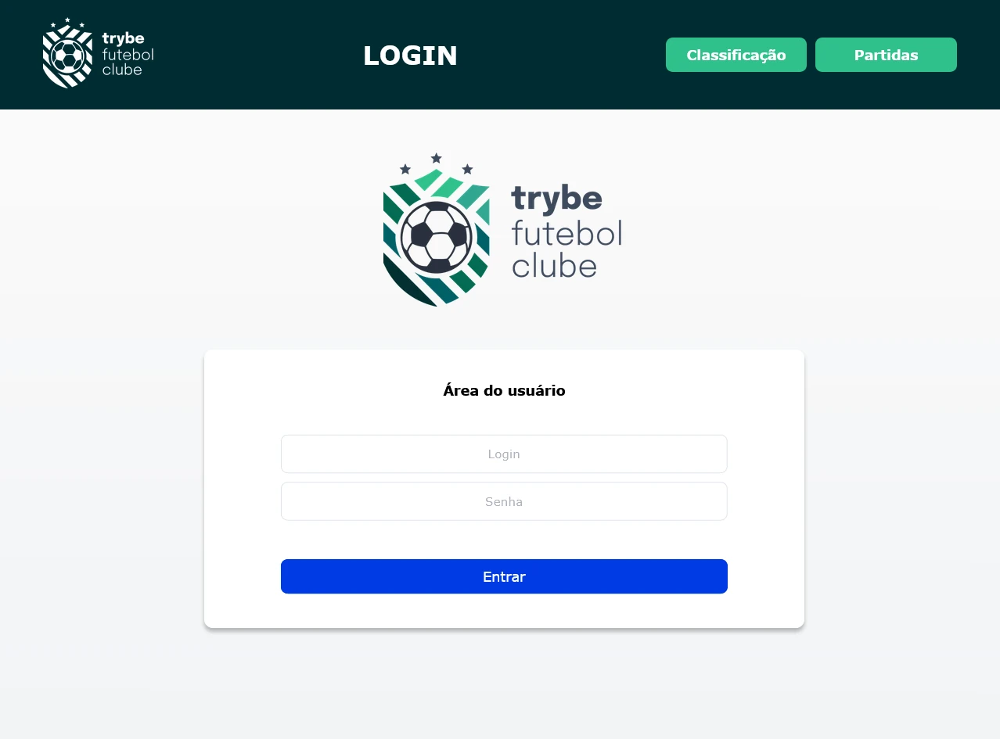
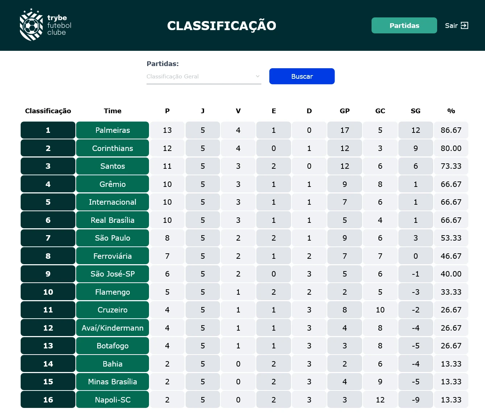
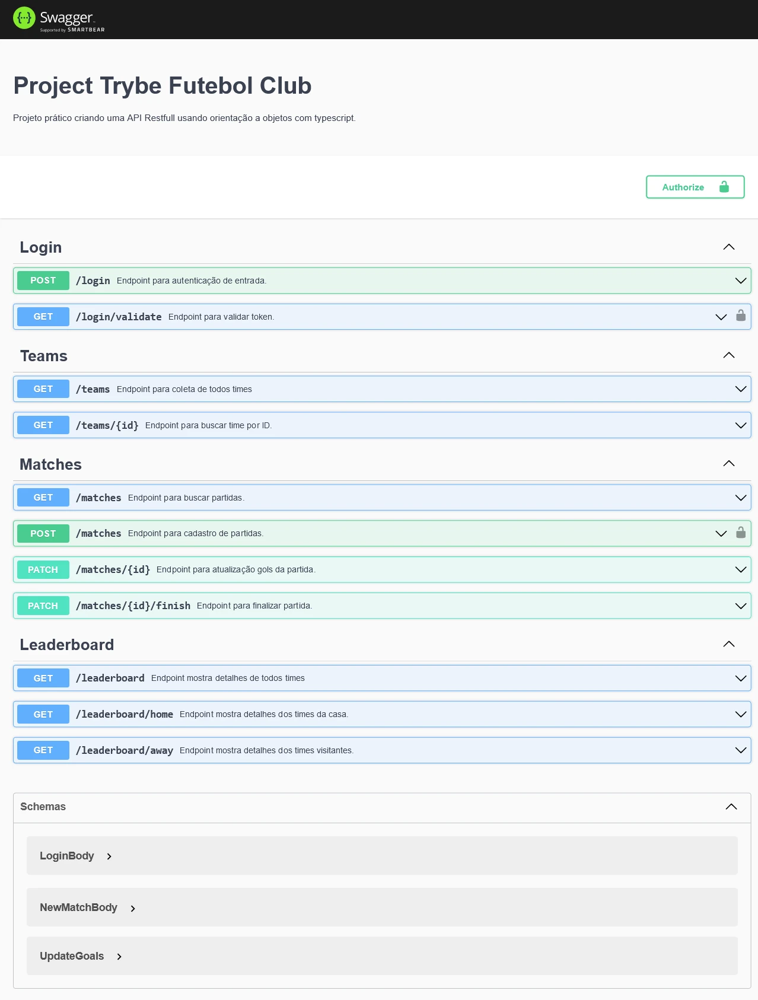

# Sobre

## Seção: `POO e SOLID`

- Seção foi dedicada a aplicar mais os conhecimentos da seção anterior, explorando mais o typescript usando orientação a objetos e SOLID.

#
<div align="center">
  <a href="https://raw.githubusercontent.com/davidrogger/trybe-project-blogs-api/readme-update/readme-imgs/project_top.webp">
    
  </a>
  <a href="https://raw.githubusercontent.com/davidrogger/trybe-project-blogs-api/readme-update/readme-imgs/project_mid.webp">
    
  </a>
  <a href="https://raw.githubusercontent.com/davidrogger/trybe-project-blogs-api/readme-update/readme-imgs/project_bot.webp">
    
  </a>
</div>

>*Imagens da documentação swagger e do frontend da trybe*
#
## Projeto: `TFC - Trybe Futebol Clube`

- Neste projeto foi desenvolvido uma API para ser consumida por um **frontend desenvolvido pela trybe**, onde é criado um ambiente classificando times em partidas de futebol.
- Usando a ORM sequelize para coletar, criar, editar e deletar informações do banco.

# Tecnologias e ferramentas usadas 🛠


# Desafios

- Realização da dockerização dos apps, network, volume e compose;
- Modelagem de dados com MySQL com sequelize;
- Criação e associação de tabelas;
- Construção de uma API Rest com endpoints para consumir os models criados;

# Conclusão

- Técnicamente por ser algo que garante a melhor qualidade do projeto, foquei no uso do TDD (Test Driven Development), imaginar e prever o fluxo e abstração de cada funcionalidade na API, para criar um teste para caso de falha e acerto, construir frases mais acertivas que deixam claro o que o teste está realizando para em caso de falhas, ser nítido onde ocorreu o erro, inicialmente na aplicação usei muito o teste manual abrindo o thunderclient para ver se realmente os testes estavam corretos, ao começar a me familiarizar mais com os testes a agilidade se tornava maior na criação e na confiança dos testes.
- Na parte lógica o maior desafio, foi para criar a tabela de leadership, onde eu precisava classicar cada time, com base em seus resultados, definindo um filtro, onde ele era "visitante" ou da "casa".
- Foi muito gratificante, desenvolver e práticar nesse projeto o uso de classes, conseguir usar as classes para resolver o desafio para criar uma tabela de leadership, desenvolver e entender melhor os testes de integração usando o typescript.
- Usei classes para seguir o padrão inicial do projeto para definir os controllers, routes, services  mas quero melhorar o uso dos principios do SOLID, usei classes mais para familiarização, mas poderia ter aplicado vários principios no desenvolvimento, pretendo aplicar os principios de liskov, abrindo possibilidades de mudança de ORM e uma flexibilização maior no projeto.

</details>

<details>
  <summary>
    <strong>
      :newspaper_roll: Requisitos solicitados durante o desenvolvimento do projeto
    </strong>
  </summary>

 
  ### Requisitos
  *Nome* | *Avaliação*
  --- | :---:
  1 - Desenvolva em /app/backend/src/database nas pastas correspondentes, uma migration e um model para a tabela de users | :heavy_check_mark:
  2 - Desenvolva testes que cubram no mínimo 5 por cento dos arquivo backend em /src com um mínimo de 7 linhas cobertas | :heavy_check_mark:
  3 - Desenvolva o endpoint /login no backend de maneira ele permita o acesso com dados válidos no frontend | :heavy_check_mark:
  4 - Desenvolva testes que cubram no mínimo 10 por cento dos arquivo backend em /src com um mínimo de 19 linhas cobertas | :heavy_check_mark:
  5 - Desenvolva o endpoint /login no backend de maneira ele não permita o acesso sem informar um email no frontend | :heavy_check_mark:
  6 - Desenvolva testes que cubram no mínimo 10 por cento dos arquivo backend em /src com um mínimo de 19 linhas cobertas | :heavy_check_mark:
  7 - Desenvolva o endpoint /login no backend de maneira ele não permita o acesso sem informar uma senha no frontend | :heavy_check_mark:
  8 - Desenvolva testes que cubram no mínimo 20 por cento dos arquivo backend em /src com um mínimo de 35 linhas cobertas | :heavy_check_mark:
  9 - Desenvolva o endpoint /login no backend de maneira ele não permita o acesso com um email inválido no frontend | :heavy_check_mark:
  10 - Desenvolva testes que cubram no mínimo 30 por cento dos arquivo backend em /src com um mínimo de 45 linhas cobertas | :heavy_check_mark:
  11 - Desenvolva o endpoint /login no backend de maneira ele não permita o acesso com uma senha inválida no frontend | :heavy_check_mark:
  12 - Desenvolva o endpoint /login/validate no backend de maneira ele retorne os dados corretamente no frontend | :heavy_check_mark:
  13 - Desenvolva testes que cubram no mínimo 45 por cento dos arquivo backend em /src com um mínimo de 70 linhas cobertas | :heavy_check_mark:
  14 - Desenvolva em /app/backend/src/database nas pastas correspondentes, uma migration e um model para a tabela de teams | :heavy_check_mark:
  15 - Desenvolva o endpoint /teams no backend de forma que ele possa retornar todos os times corretamente | :heavy_check_mark:
  16 - Desenvolva o endpoint /teams/:id no backend de forma que ele possa retornar dados de um time específico | :heavy_check_mark:
  17 - Desenvolva testes que cubram no mínimo 60 por cento dos arquivo backend em /src com um mínimo de 80 linhas cobertas | :heavy_check_mark:
  18 - Desenvolva em /app/backend/src/database nas pastas correspondentes, uma migration e um model para a tabela de matches | :heavy_check_mark:
  19 - Desenvolva o endpoint /matches de forma que os dados apareçam corretamente na tela de partidas no frontend | :heavy_check_mark:
  20 - Desenvolva o endpoint /matches de forma que seja possível filtrar as partidas em andamento na tela de partidas do frontend | :heavy_check_mark:
  21 - Desenvolva o endpoint /matches de forma que seja possível filtrar as partidas finalizadas na tela de partidas do frontend | :heavy_check_mark:
  22 - Desenvolva testes que cubram no mínimo 80 por cento dos arquivo backend em /src com um mínimo de 100 linhas cobertas | :heavy_check_mark:
  23 - Desenvolva o endpoint /matches de modo que seja possível salvar uma partida com o status de inProgress como true no banco de dados | :heavy_check_mark:
  24 - Desenvolva o endpoint /matches de modo que seja possível salvar uma partida com o status de inProgress como false no banco de dados | :heavy_check_mark:
  25 - Desenvolva o endpoint /matches de forma que não seja possível inserir uma partida com times iguais | :heavy_check_mark:
  26 - Desenvolva o endpoint /matches de forma que não seja possível inserir uma partida com time que não existe na tabela teams | :heavy_check_mark:
  27 - Desenvolva o endpoint /matches de forma que não seja possível inserir uma partida sem um token válido | :heavy_check_mark:
  28 - Desenvolva o endpoint /matches de forma que seja possível atualizar partidas em andamento | :heavy_check_mark:
  29 - Desenvolva o endpoint /leaderboard/home de forma que seja possível filtrar a classificações dos times quando mandantes na tela de classificação do frontend com os dados iniciais do banco de dados | :heavy_check_mark:
  30 - Desenvolva o endpoint /leaderboard/home de forma que seja possível filtrar a classificações dos times quando mandantes na tela de classificação do frontend e ao inserir a partida Corinthians 2 X 1 Internacional a tabela será atualizada | :heavy_check_mark:
  31 - Desenvolva o endpoint /leaderboard/away de forma que seja possível filtrar as classificações dos times quando visitantes na tela de classificação do frontend com os dados iniciais do banco de dados | :heavy_check_mark:
  32 - Desenvolva o endpoint /leaderboard/away de forma que seja possível filtrar a classificações dos times quando visitantes na tela de classificação do frontend e ao inserir a partida Corinthians 2 X 1 Internacional a tabela será atualizada | :heavy_check_mark:
  33 - Desenvolva o endpoint /leaderboard de forma que seja possível filtrar a classificação geral dos times na tela de classificação do frontend com os dados iniciais do banco de dados | :heavy_check_mark:
  34 - Desenvolva o endpoint /leaderboard de forma que seja possível filtrar a classificação geral dos times na tela de classificação do frontend e ao inserir a partida Flamengo 3 X 0 Napoli-SC a tabela será atualizada | :heavy_check_mark:
  35 - Desenvolva o endpoint /leaderboard de forma que seja possível filtrar a classificação geral dos times na tela de classificação do frontend e ao inserir a partida Minas Brasília 1 X 0 Ferroviária a tabela será atualizada | :heavy_check_mark:


</details>

<details>
  <summary>
    <strong>
      :memo: Todo list
    </strong>
  </summary>

  - [x] - ~~Criar aplicação com base nos requisitos da trybe.~~ 

</details>

<details>
  <summary>
    <strong>
      :computer: Instruções do  Projeto
    </strong>
  </summary>

> ### Importante seguir a ordem apresentada a baixo, para o funcionamento.

<details>
<summary>
  <strong>
    ⚠️ Configurações mínimas para execução do projeto
  </strong>
</summary>

  > - Sistema Operacional Distribuição Unix
  > - Node versão >= 16
  > - Docker
  > - Docker-compose versão >=1.29.2
  > - API Client ([Thunder Client](https://www.thunderclient.com/), [Insomnia](https://insomnia.rest/), [POSTMAN](https://www.postman.com/), ou algum outro de sua preferência)

  </details>

  <details>
  <summary>
    <strong>
      ⚠️ Inicie o docker-compose
    </strong>
  </summary>

  >Após clonar o respositório para iniciar o docker compose, você deve dentro da pasta raiz do projeto usar o comando: `docker-compose up -d`
  >Verifique os containers, usando o comando `docker ps` no terminal. Deve aparecer três containers com o nome de *app-frontend-1*, *app_backend* e *db*.
  </details>

  <details>
  <summary>
    <strong>
      :family_man_woman_girl_boy: Usuários
    </strong>
  </summary>

  Usuário administrador:
  ```
  email: admin@admin.com
  password: secret_admin
  ```
  Usuário cliente:
  ```
  email: user@user.com
  password: secret_user
  ```

</details>

  <details>
    <summary>
      <strong>
        🗂 Acessando as Rotas
      </strong>
    </summary>

  >Para acessar e testar as rotas:
  >1. Usando algum API Cliente, conforme citado nas configurações mínimas.
  >2. Acessando a documentação gerada pelo swagger `localhost:3000/api-docs`.

  <details>
  <summary>
      <span>Endpoint <code>/login</code></span>
  </summary>

  # POST - localhost:3001/login

  > - Rota responsável autenticar usuário e gerar um token de acesso.
  > - Para autenticar o usuário, é necessário realizar uma requisição POST para URL: `localhost:3000/login` contendo um corpo json com:
  > - `email` Um email cadastrado.
  > - `password` Senha correspondente ao usuário cadastrado.
  > ### Exemplo:
  >```
  >{
  >  "email": "user@user.com",
  >  "password": "secret_user"
  >}
  >```
  > ### Status:
  > - **`200`**: Retorna um json com o token para acessar rotas que precisam de autenticação.
  > - **`400`**: Retorna um json com a mensagem indicando qual campo está pendente na requisição.
  > - **`401`**: Retorna um json com a mensagem indicando que o usuário ou senha são inválidos.
  > - **`500`**: Retorna um json com a mensagem indicando o error que ocorreu internamente no servidor.

  # POST - localhost:3001/login/validate

  > - Rota responsável verificar o token de acesso.
  > - É necessário adicionar ao headers o token para executar esta requisição.
  > - Para verificar o token, é necessário realizar uma requisição GET para URL: `localhost:3000/login/validate`.
  > ### Status:
  > - **`200`**: Retorna um json com a função da autenticação.
  > - **`401`**: Retorna um json com a mensagem de acesso não autorizado, no caso de ausencia do token ou falta de validade.
  > - **`500`**: Retorna um json com a mensagem indicando o error que ocorreu internamente no servidor.

  </details>

  <details>
  <summary>
      <span>Endpoint <code>/teams</code></span>
  </summary>

  # GET - localhost:3001/teams

  > - Rota responsável mostrar Todos times cadastrados
  > - Para mostrar os times, é necessário realizar uma requisição GET para URL: `localhost:3000/teams`.
  > ### Status:
  > - **`200`**: Retorna um json com todos times cadastrados.
  > - **`500`**: Retorna um json com a mensagem indicando o error que ocorreu internamente no servidor.

  ## GET - `localhost:3000/teams/:id`

  > - Rota responsável buscar detalhes de uma time por seu id.
  > - Para buscar o time pelo id, é necessário realizar uma requisição GET com um parametros `id`.
  > ### Exemplo:
  >```
  >localhost:3000/teams/1
  >```
  > ### Status:
  > - **`200`**: Retorna um json com os detalhes do time.
  > - **`400`**: Retorna um json com a mensagem `Id must be a number`.
  > - **`404`**: Retorna um json com a mensagem `There is no team with such id!`.
  > - **`500`**: Retorna um json com a mensagem indicando o error que ocorreu internamente no servidor.

  </details>

  <details>
  <summary>
      <span>Endpoint <code>/matches</code></span>
  </summary>

  # GET - localhost:3001/matches

  > - Rota responsável mostrar todas partidas cadastradas com filtragem de partidas em progresso.
  > - Para mostrar as partidas, é necessário realizar uma requisição GET para URL: `localhost:3000/matches`.
  > Caso deseje adicionar o filtro apresentando somente as partidas em progresso, basta adicionar um parametro inProgress true na rota: `localhost:3001/matches?inProgress=true`.
  > ### Status:
  > - **`200`**: Retorna um json com todas partidas cadastrados ou dentro do filtro desejado.
  > - **`500`**: Retorna um json com a mensagem indicando o error que ocorreu internamente no servidor.

  </details>

  <details>
  <summary>
      <span>Endpoint <code>/leaderboard</code></span>
  </summary>


  </details>

  </details>
</details>

#

<div align="right">
  
</div>
