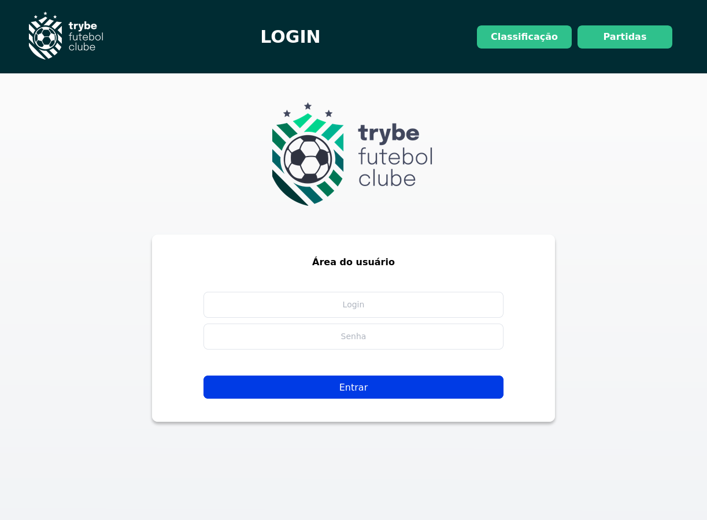
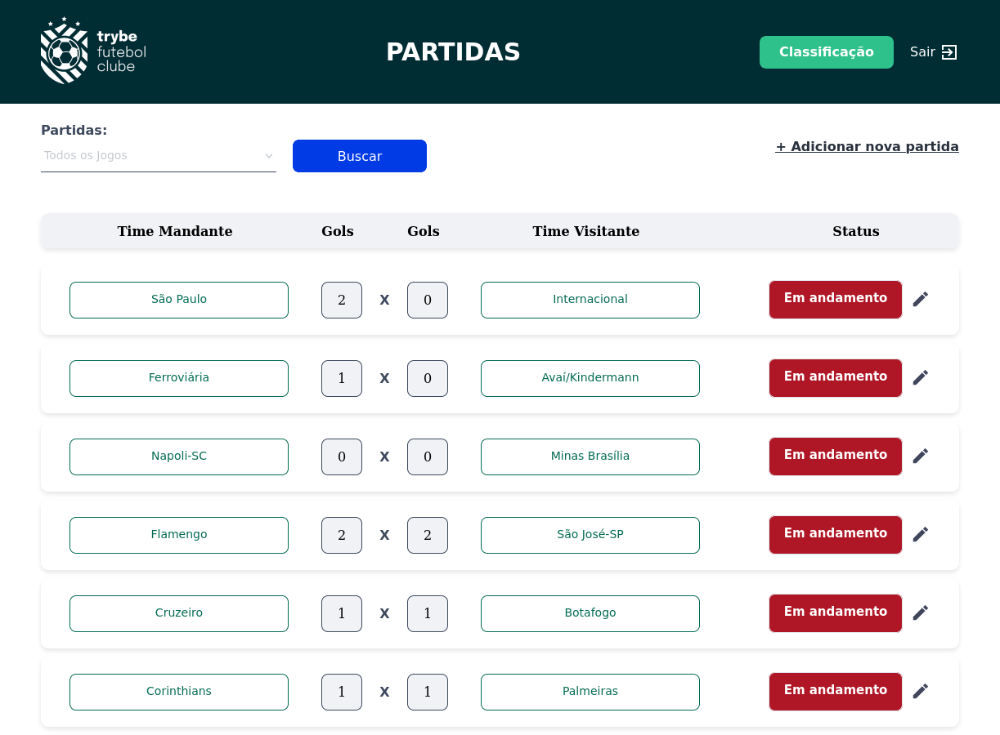
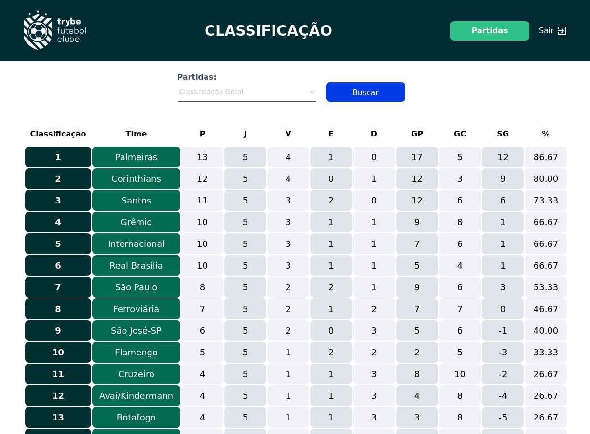

# 🚧 README em construção 🚧

# Sobre o Projeto 

- Neste projeto foi desenvolvido uma API para ser consumida por um **frontend desenvolvido pela trybe**, onde é criado um ambiente classificando times em partidas de futebol.
- Usando a ORM sequelize para coletar, criar e remover informações do banco.
- Imagens abaixo, são de desenvolvimento da trybe relativas ao front.

<a href="./screenshots/tfc_login.png">
  </img>
</a>
<a href="./screenshots/tfc_matches.png">
  </img>
</a>
<a href="./screenshots/tfc_leadership.png">
  </img>
</a>

# Tecnologias e ferramentas usadas 🛠


# Desafios

- Técnicamente por ser algo que garante a melhor qualidade do projeto, foquei no uso do TDD (Test Driven Development), imaginar e prever o fluxo e abstração de cada funcionalidade na API, para criar um teste para caso de falha e acerto, construir frases mais acertivas que deixam claro o que o teste está realizando para em caso de falhas, ser nítido onde ocorreu o erro, inicialmente na aplicação usei muito o teste manual abrindo o thunderclient para ver se realmente os testes estavam corretos, ao começar a me familiarizar mais com os testes a agilidade se tornava maior na criação e na confiança dos testes.
- Na parte lógica o maior desafio, foi para criar a tabela de leadership, onde eu precisava classicar cada time, com base em seus resultados, definindo um filtro, onde ele era "visitante" ou da "casa".


# Conclusão

- Foi muito gratificante, desenvolver e práticar nesse projeto o uso de classes, conseguir usar as classes para resolver o desafio para criar uma tabela de leadership, desenvolver e entender melhor os testes de integração usando o typescript.
- Usei classes para seguir o padrão inicial do projeto para definir os controllers, routes, services  mas quero melhorar o uso dos principios do SOLID, usei classes mais para familiarização, mas poderia ter aplicado vários principios no desenvolvimento, pretendo aplicar os principios de liskov, abrindo possibilidades de mudança de ORM e uma flexibilização maior no projeto.

# Iniciando o Projeto Trybe Futebol Club.

Importante: seguir a ordem apresentada a baixo, para o funcionamento.

<details>
  <summary>
    <strong>
      ⚠️ Configurações mínimas para execução do projeto
    </strong>
  </summary>

   - Sistema Operacional Distribuição Unix
 - Node versão 16
 - Docker
 - Docker-compose versão >=1.29.2
 - node versão 16.15.0 LTS ou superior

</details>

<details>
  <summary>
    <strong>
      ⚙️ Variáveis de ambiente
    </strong>
  </summary>

Deve-se criar um arquivo .env na raiz do projeto com o seguinte conteúdo:
```
#### SERVER VARS
NODE_ENV=development
API_PORT=3000

#### DATABASE VARS
MYSQL_HOST=localhost
MYSQL_PORT=3306
MYSQL_DB_NAME=blogs-api
MYSQL_USER=root
MYSQL_PASSWORD=password

#### SECRECT VARS
JWT_SECRET=suaSenhaSecreta
```
</details>

<details>
  <summary>
    <strong>
      ⚠️ Inicie o docker-compose
    </strong>
  </summary>

Para iniciar o docker compose, você deve estar dentro da pasta raiz do projeto usar o comando: `docker-compose up -d`

Verifique se os container está funcionando e rodando com o comando `docker ps`. Devem aparecer dois container com o nome de *blogs_api* e *blogs_api_db*.

</details>

</details>
